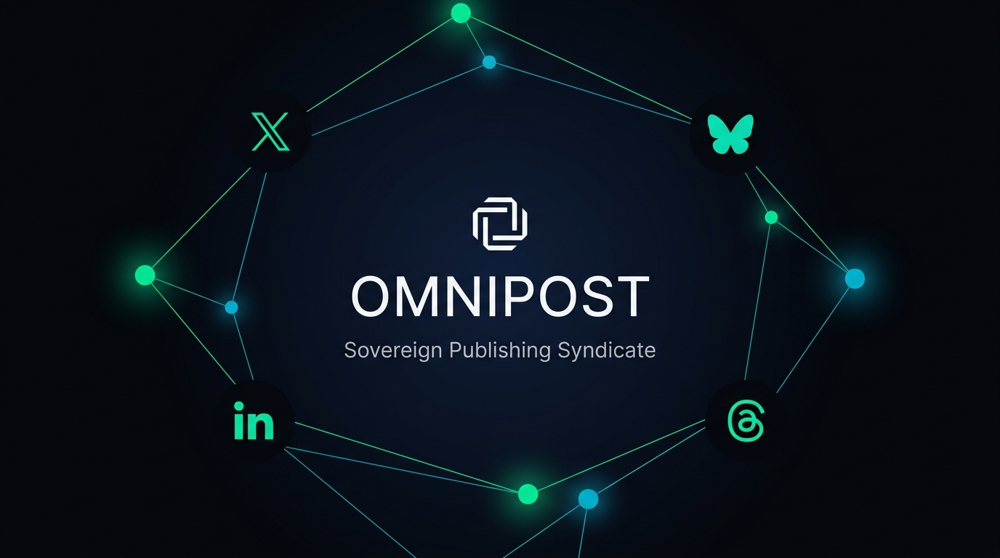
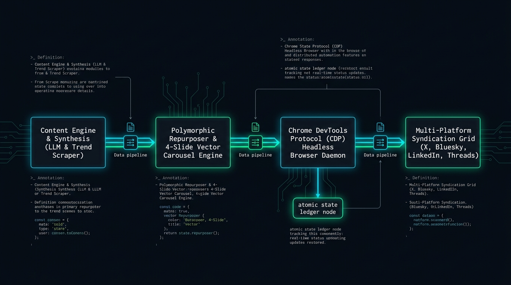

<p align="center">
  
</p>

<p align="center">
  <a href="https://github.com/Lordporus/omnipost/releases"></a>
  <a href="https://python.org"></a>
  <a href="LICENSE"></a>
  <a href="https://github.com/Lordporus/omnipost/actions"></a>
  
  
</p>

<h1 align="center">OmniPost V2.0</h1>

<p align="center">
  <b>Autonomous, Zero-Cost Cross-Platform Publishing Syndicate for AI Agents & Technical Builders.</b><br />
  <i>Simultaneous distribution across X, Bluesky, LinkedIn, and Meta Threads without SaaS fees, recurring API subscriptions, or platform limits.</i>
</p>

---

## The Sovereign Distribution Thesis

Technical founders and autonomous AI agents face a broken distribution reality:
* **The SaaS Tax:** Mainstream social schedulers charge \$50 to \$250/month, yet remain constrained by cloud API rate limits.
* **The Platform API Paywall:** Commercial API access on X starts at \$100/month; LinkedIn partner programs restrict document uploads behind proprietary enterprise audits.
* **Format Fragmentation:** What performs on X (short punchy contrarian hook) fails on LinkedIn (technical case study + document carousel), Bluesky (decentralized ATProto thread), and Meta Threads (conversational builder dialogue).

**OmniPost V2.0 resolves this through local sovereignty:**
It runs directly on your local workstation, inside a self-contained Docker container, or on a \$5/mo Linux VPS. By automating your own authenticated browser sessions via the **Chrome DevTools Protocol (CDP)** and communicating natively with the **ATProto XRPC protocol**, OmniPost delivers enterprise-grade multi-platform syndication with **\$0 API costs, forever.**

---

## System Architecture

<p align="center">
  
</p>

OmniPost operates as a deterministic, decoupled four-stage pipeline:

```
┌─────────────────────────────────┐     ┌──────────────────────────────────┐
│  1. RESEARCH & SYNTHESIS        │     │  2. POLYMORPHIC REPURPOSER       │
│  • Hacker News, arXiv, RSS      │ ──> │  • Voice profiling & tone matching│
│  • Local LLM / Cloud Provider   │     │  • 1 Insight ──> 4 Target Shapes  │
└─────────────────────────────────┘     └──────────────────────────────────┘
                 │                                        │
                 ▼                                        ▼
┌─────────────────────────────────┐     ┌──────────────────────────────────┐
│  4. VERIFICATION & ATOMIC LOG   │     │  3. VISUAL ENGINE & CAROUSEL     │
│  • Real-time timeline scraping  │ <── │  • 16:9 Pillow Infocards (PNG)   │
│  • Activity URN confirmation    │     │  • 4-Slide Vector PDF Carousels  │
│  • Atomic write to state.json   │     │  • Chrome CDP Page.printToPDF    │
└─────────────────────────────────┘     └──────────────────────────────────┘
```

1. **Intelligence & Synthesis Engine (`scripts/generate.py`):** Automatically ingests technical signals from Hacker News, arXiv, and curated RSS feeds. Synthesizes a high-signal topic via your configured LLM (Gemini, Claude, OpenAI, OpenRouter, or zero-cost local heuristics).
2. **Polymorphic Adaptation (`scripts/repurpose.py`):** Dynamically reshapes one core concept into four platform-native payload formats.
3. **Alive Tech Visual Engine (`render/`):** Generates high-density, multi-page vector PDF carousels directly inside headless Chromium over CDP sockets—eliminating fragile C-dependencies (Cairo, Pango, WeasyPrint).
4. **Headless Browser Daemon & Dispatcher (`scripts/browser_daemon.py`, `scripts/autoposter.py`):** Orchestrates stealth browser tabs and ATProto sessions, publishes payloads, and validates live URL/URN status before updating the atomic state ledger.

---

## 4-Platform Capabilities Matrix

| Platform | Channel Driver | Visual Format | Verification Mechanism | Operating Cost |
| :--- | :--- | :--- | :--- | :---: |
| **X (Twitter)** | Stealth Chrome CDP Session | 16:9 Infocard (`.png`) | DOM Composer Settle + Tweet URL Parse | **\$0.00** |
| **Bluesky** | Native ATProto XRPC | 16:9 Infocard (`.png`) | Microsecond Commit Response + CID/URI | **\$0.00** |
| **LinkedIn** | ProseMirror DOM Automation | 4-Slide Vector PDF Carousel | Activity Feed Read-Back (`urn:li:activity`) | **\$0.00** |
| **Meta Threads** | Headless Chrome CDP Session | 16:9 Infocard (`.png`) | Profile Activity Scrape & Confirmation | **\$0.00** |

---

## Visual Engine: The 4-Slide "Alive Tech" Carousel

<p align="center">
  
</p>

OmniPost V2.0 features an in-house visual engine engineered for maximum engagement and visual authority on LinkedIn.

* **Strict 4-Slide Progression:**
  * **Slide 1 (Hero Hook):** High-impact typographic headline, category pill, and author badge.
  * **Slide 2 (The Problem Space):** Context narrative panel with cyber amber accent badges and friction bullets.
  * **Slide 3 (Core Architecture):** Syntax-highlighted technical code block with cyan accents.
  * **Slide 4 (Production Checklist & CTA):** Actionable takeaways with emerald SVG checkmarks and sovereign outro banner.
* **"Alive Tech" Design System:** Obsidian Black (`#06090E`), Deep Navy (`#121927`), Signal Emerald (`#00F59B`), and Cyber Amber (`#F59E0B`).
* **Zero Duplication Guarantee:** The content parser (`parse_linkedin_payload`) strips raw composite markdown and eliminates redundant headline repetitions across slides.
* **Headless CDP Vector PDF:** Rendered via `Page.printToPDF` at native 1080x1080 resolution (11.25" square at 96 DPI).

```bash
# Render HTML preview and vector PDF from today's draft:
python -m render.carousel

# Generate local HTML proofing preview only:
python -m render.carousel --preview-only
```

---

## Quickstart & Setup

### 1. Interactive 6-Step CLI Wizard

Run the interactive setup wizard to configure accounts, choose your AI provider, and set posting preferences:

```bash
git clone https://github.com/Lordporus/omnipost.git
cd omnipost
python setup.py
```

```
╔═══════════════════════════════════════════════════════════════════╗
║                      OMNIPOST V2.0 ONBOARDING                     ║
║         Autonomous Sovereign Multi-Platform Distribution          ║
╚═══════════════════════════════════════════════════════════════════╝

[1/6] Account Credentials & Handles (X, Bluesky, LinkedIn, Threads)
[2/6] Multi-LLM Provider (Gemini / Claude / OpenAI / OpenRouter / Local Heuristic)
      ↳ Validating live 1-token API ping... [OK]
[3/6] Content Strategy & Voice Profile Configuration
[4/6] System Timezone Detection (Auto: Asia/Kolkata)
[5/6] Remote Webhook Alerting (Telegram Bot / Discord Embeds)
[6/6] Operating Mode (Dry-Run vs Autonomous Live Dispatch)

[SETUP] Configuration sealed to config.json & .env. Ready for production.
```

### 2. Automated / Non-Interactive CI Mode

For CI/CD runners, Docker builds, or automated server provisioning:

```bash
python setup.py --non-interactive
```

---

## Deployment Modes

### Mode A: Local Workstation (Windows / macOS)
Ideal for developers running background automation alongside their daily workflow.

```bash
# 1. Verify runtime readiness
python scripts/prereq_check.py

# 2. Run daily pipeline to draft content and render visuals
python scripts/pipeline.py

# 3. Test execution safely without posting live
python scripts/autoposter.py --dry-run

# 4. Install automated background runner on Windows (runs every 15 mins)
powershell -ExecutionPolicy Bypass -File scripts/setup_scheduler.ps1
```

### Mode B: Docker Container Stack
Fully isolated container packaged with Python 3.12-slim, Chromium, and Xvfb virtual display.

```bash
# Start the background publishing daemon
docker compose up -d

# Inspect live logs and health status
docker compose logs -f
docker compose ps
```
* **Collision Guard:** `docker-entrypoint.sh` protects against directory-bind mount collisions on clean clones.
* **Persistent Sessions:** Browser profiles and cookies persist in the `omnipost_browser_data` Docker volume.

### Mode C: 1-Click Headless Linux VPS (Ubuntu 22.04 / 24.04)
Deploy onto any \$5/mo cloud server (DigitalOcean, Hetzner, Linode, AWS EC2):

```bash
sudo bash scripts/deploy_vps.sh
```

This single command:
1. Installs system packages (`chromium-browser`, `xvfb`, `fonts-liberation`, `python3-venv`).
2. Clones and configures `/opt/omnipost`.
3. Runs non-interactive onboarding and guarantees state ledger files.
4. Registers and starts `omnipost.service` using a non-blocking background Xvfb runner.

```bash
# Check service status
sudo systemctl status omnipost
sudo journalctl -u omnipost -f
```

---

## Remote Webhook Monitoring & Session Alerts

OmniPost provides instant notifications via Telegram and Discord whenever posts are dispatched or authentication sessions require re-login:

* **Post Success Alerts:** Rich embed detailing post link, media status, and scheduled slot.
* **Session Expiration Guard:** Fast-fail alerts immediately dispatched if browser cookies expire, preventing silent pipeline stalls.

---

## Command Reference

| Command | Description |
| :--- | :--- |
| `python setup.py` | Interactive 6-step CLI onboarding wizard with live credential validation. |
| `python setup.py --non-interactive` | Headless setup for automated VPS and container provisioning. |
| `python scripts/prereq_check.py` | Diagnostic checker validating Python, Git, Browser, Docker, and ports. |
| `python scripts/doctor.py --healthcheck` | Fast binary healthcheck (exit code 0/1) for container orchestrators. |
| `python scripts/doctor.py --live` | Deep diagnostic testing network feeds, browser CDP, and platform sessions. |
| `python scripts/pipeline.py` | Runs research, generates polymorphic drafts, and renders visual assets. |
| `python scripts/autoposter.py --dry-run` | Evaluates due schedule slots and simulates dispatch without live posting. |
| `python scripts/publish_now.py --text "..."` | On-demand instant broadcast across any combination of platforms. |
| `python -m render.carousel` | Compiles 1080x1080 HTML preview and vector PDF carousel. |
| `python scripts/daemon.py` | Long-running supervisor managing jittered posting and morning research. |

---

## Architectural Guarantees & Fault Tolerance

1. **Partial-Failure Isolation:** If LinkedIn triggers a rate limit or cooldown, successful posts on X, Bluesky, and Threads are recorded immediately. Only failed channels are queued for subsequent retry intervals.
2. **Crash-Safe Atomic Ledger:** `state.json` updates utilize atomic filesystem replacement. Corrupted JSON states are impossible even during sudden server reboots.
3. **Browser Auto-Healer:** `scripts/browser_daemon.py` monitors port 9444 and automatically respawns headless Chrome with appropriate sandbox flags (`--no-sandbox`, `--disable-dev-shm-usage`) if the browser terminates.
4. **Zero Vendor Lock-In:** All credentials, cookies, and local database ledgers reside exclusively on your machine.

---

## Test Suite & Verification

OmniPost maintains comprehensive test coverage across all adapters, validators, and rendering subsystems:

```bash
python -m pytest -v
```

```
============================= test session starts =============================
platform win32 -- Python 3.12.10, pytest-8.3.2
collected 153 items

tests/test_adapters.py ...........                                       [  7%]
tests/test_analytics.py .....                                            [ 10%]
tests/test_bluesky.py .........                                          [ 16%]
tests/test_browser_daemon.py ......                                      [ 20%]
tests/test_carousel.py .......                                           [ 24%]
tests/test_docker_config.py ...                                          [ 26%]
tests/test_feedback.py ...                                               [ 28%]
tests/test_generate.py ....                                              [ 31%]
tests/test_infocard.py ...                                               [ 33%]
tests/test_ledger.py ....                                                [ 35%]
tests/test_linkedin.py ......                                            [ 39%]
tests/test_linkedin_carousel.py ....                                     [ 42%]
tests/test_multi_platform.py ....                                        [ 45%]
tests/test_notify.py ......                                              [ 49%]
tests/test_notify_webhook.py ......                                      [ 52%]
tests/test_omnipost.py ............                                      [ 60%]
tests/test_pipeline.py ....                                              [ 63%]
tests/test_prereq_check.py ...........                                   [ 70%]
tests/test_repurposer.py ......                                          [ 74%]
tests/test_retry_isolation.py .                                          [ 75%]
tests/test_threads.py ......                                             [ 79%]
tests/test_validator.py ....................                             [ 92%]
tests/test_vps_deployment.py ...                                         [ 94%]
tests/test_wizard.py .........                                           [100%]

======================= 153 passed in 135.50s (0:02:15) =======================
```

---

## Contributing & Development

Contributions to adapters, rendering styles, or scheduling algorithms are welcome.

1. Fork the repository.
2. Create your feature branch (`git checkout -b feat/new-platform-adapter`).
3. Ensure all tests pass (`python -m pytest`).
4. Commit your changes (`git commit -m "feat(adapter): add Mastodon CDP/API support"`).
5. Open a Pull Request.

---

## License

OmniPost is open-source software licensed under the [MIT License](LICENSE).
