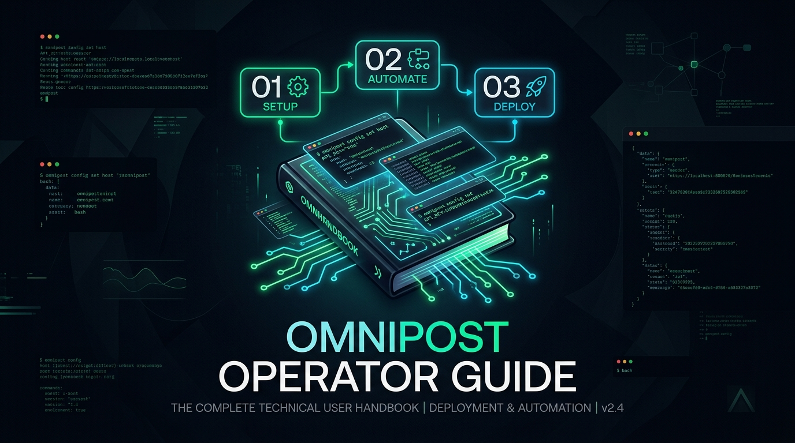
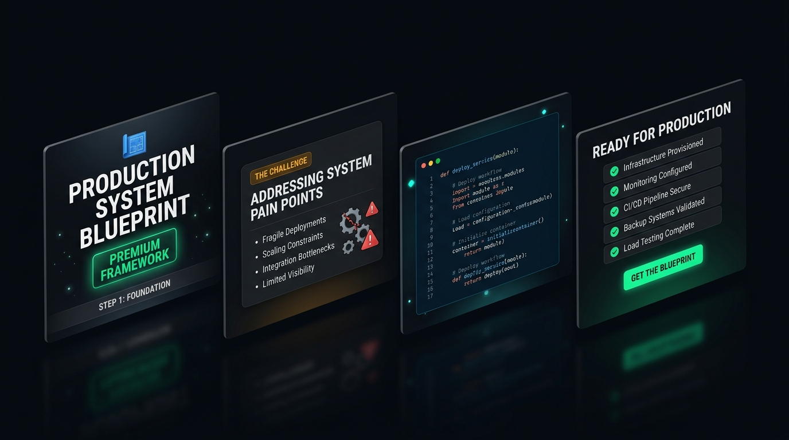

<p align="center">
  
</p>

# OmniPost V2.0: The Complete Operator Guide

Welcome to the definitive user handbook for **OmniPost V2.0**. This guide walks you through everything required to run an autonomous, multi-platform publishing syndicate across **X (Twitter), Bluesky, LinkedIn, and Meta Threads** with **zero recurring API fees**.

---

## Table of Contents

1. [Mental Model & Prerequisites](#1-mental-model--prerequisites)
2. [Quickstart: The 5-Minute Setup](#2-quickstart-the-5-minute-setup)
3. [Connecting Your 4 Social Channels](#3-connecting-your-4-social-channels)
4. [Configuring AI Models & Voice Personalization](#4-configuring-ai-models--voice-personalization)
5. [The Daily Autonomous Pipeline](#5-the-daily-autonomous-pipeline)
6. [Visual Engine: 4-Slide Vector Carousels & Infocards](#6-visual-engine-4-slide-vector-carousels--infocards)
7. [Operating Modes: Dry-Run vs Autonomous Dispatch](#7-operating-modes-dry-run-vs-autonomous-dispatch)
8. [On-Demand Broadcasts (`publish_now.py`)](#8-on-demand-broadcasts-publish_nowpy)
9. [Production Deployment Guides](#9-production-deployment-guides)
   - [A. Windows Task Scheduler](#a-windows-task-scheduler)
   - [B. Docker Compose](#b-docker-compose)
   - [C. Headless Linux VPS (Systemd)](#c-headless-linux-vps-systemd)
10. [Remote Webhook Monitoring (Telegram & Discord)](#10-remote-webhook-monitoring-telegram--discord)
11. [Diagnostics, Healthchecks & Auto-Healing](#11-diagnostics-healthchecks--auto-healing)
12. [Troubleshooting & FAQ](#12-troubleshooting--faq)

---

## 1. Mental Model & Prerequisites

### How OmniPost Works
Traditional publishing tools (Buffer, Hootsuite, Typefully) act as cloud middlemen: they store your credentials on third-party servers, charge monthly subscriptions, and rely on developer APIs that impose severe rate limits and recurring costs (e.g., X API v2 at \$100/mo).

**OmniPost operates locally on your terms:**
* **Stealth Chrome DevTools Protocol (CDP):** Posts to X, LinkedIn, and Threads directly through an authenticated browser session (Edge or Chrome) running on your own machine.
* **Native ATProto Client:** Posts to Bluesky directly via XRPC network calls using an App Password.
* **Local Visual Rendering Engine:** Compiles vector PDF carousels (1080x1080) and 16:9 infographic cards locally with zero cloud dependencies.
* **Atomic State Ledger:** Records every successful post in `state.json` to guarantee zero duplicate posts, even across power cuts or network hiccups.

### System Requirements
* **Operating System:** Windows 10/11, macOS, or Linux (Ubuntu 20.04/22.04/24.04).
* **Python:** Version `3.10` or higher (`3.12` recommended).
* **Browser:** Microsoft Edge or Google Chrome installed locally (or Chromium in headless environments).
* **Git:** Installed and available on your system `PATH`.

---

## 2. Quickstart: The 5-Minute Setup

### Step 1: Clone the Repository
```bash
git clone https://github.com/Lordporus/omnipost.git
cd omnipost
```

### Step 2: Install Python Dependencies
```bash
python -m pip install -r requirements.txt
```

### Step 3: Run the Guided Onboarding Wizard
```bash
python setup.py
```
The wizard guides you through 6 sequential configuration steps:
1. **Accounts & Handles:** Input handles for X, Bluesky, LinkedIn, and Threads.
2. **AI Provider Selection:** Choose Gemini, Claude, OpenAI, OpenRouter, or Local Heuristic. Live-validates your API key with a 1-token test ping.
3. **Content Strategy:** Define your tech niche, voice tone, author attribution, and daily time slots.
4. **Timezone:** Auto-detects your system timezone.
5. **Alerts:** Optionally configure Telegram or Discord webhooks for instant notifications.
6. **Operating Mode:** Select `dry-run` (for initial testing) or `live` (for autonomous publishing).

### Step 4: Run the Diagnostic Pre-flight Check
```bash
python scripts/prereq_check.py
```
Ensure all items return `"ok": true`.

---

## 3. Connecting Your 4 Social Channels

| Platform | Authentication Method | Setup Instructions |
| :--- | :--- | :--- |
| **X (Twitter)** | Authenticated Browser Session | Open your browser, log in to [x.com](https://x.com), and ensure the session stays active. |
| **Bluesky** | Handle + App Password | Go to **Settings $\rightarrow$ Advanced $\rightarrow$ App Passwords** in Bluesky, generate an app password, and paste it into `.env` as `BSKY_APP_PASSWORD`. |
| **LinkedIn** | Authenticated Browser Session | Log in to [linkedin.com](https://linkedin.com) in your browser profile. |
| **Meta Threads** | Authenticated Browser Session | Log in to [threads.net](https://threads.net) in your browser profile. |

> **Pro Tip:** When running locally on Windows, Microsoft Edge automatically uses your everyday default profile if configured in `config.json` under `"browser": {"profile_path": "..."}`.

---

## 4. Configuring AI Models & Voice Personalization

OmniPost supports five distinct LLM backends:

```bash
# In your .env file:
LLM_PROVIDER=gemini       # Options: gemini | openai | claude | openrouter | local
GEMINI_API_KEY=your_key   # For Google Gemini 1.5 Flash (Recommended: Fast & Free tier)
OPENAI_API_KEY=your_key   # For OpenAI GPT-4o-mini
ANTHROPIC_API_KEY=your_key # For Claude 3.5 Sonnet
OPENROUTER_API_KEY=your_key # For multi-model routing
```

### Customizing Your Voice Profile
OmniPost shapes generated posts to reflect your unique writing identity. Edit `references/voice-profile.local.md` to define:
* **Writing Style:** Contrarian, technical, conversational, or blueprint-oriented.
* **Prohibited Words:** Jargon to avoid (e.g., "game-changer", "dive in", "delve").
* **Formatting Rules:** Bullet formats, line breaks, and hashtag preferences.

To verify your voice parameters:
```bash
python scripts/voice_profile.py
```

---

## 5. The Daily Autonomous Pipeline

OmniPost divides the 24-hour cycle into **Research**, **Polymorphic Repurposing**, and **Jittered Posting**.

```
  11:00 AM          13:00            16:00            20:00            00:00
┌──────────────┐ ┌──────────────┐ ┌──────────────┐ ┌──────────────┐ ┌──────────────┐
│ DAILY DIGEST │ │ SLOT 1 POST  │ │ SLOT 2 POST  │ │ SLOT 3 POST  │ │ SLOT 4 POST  │
│ Scrape & Plan│ │ Jitter ±15m  │ │ Jitter ±15m  │ │ Jitter ±15m  │ │ Jitter ±15m  │
└──────────────┘ └──────────────┘ └──────────────┘ └──────────────┘ └──────────────┘
```

### 1. Generating Today's Plan On-Demand
To manually trigger the daily intelligence gathering and generate today's draft:
```bash
python scripts/pipeline.py
```
This executes:
1. **Signal Aggregation:** Ingests top discussions from Hacker News, arXiv, and developer feeds.
2. **Draft Synthesis:** Formats posts tailored for each platform into `drafts/YYYY-MM-DD.json`.
3. **Visual Compilation:** Automatically renders 16:9 infocards and 1080x1080 LinkedIn PDF carousels.

### 2. Reviewing & Editing Drafts
Before scheduled slots trigger, you can inspect or edit `drafts/YYYY-MM-DD.json`:
```json
{
  "date": "2026-10-06",
  "slots": [
    {
      "slot": "13:00",
      "headline": "Deterministic Agent Architectures",
      "platforms": {
        "x": { "text": "...", "media": ["scratch/infocards/daily_card.png"] },
        "bluesky": { "text": "...", "media": ["scratch/infocards/daily_card.png"] },
        "linkedin": { "text": "...", "media": ["scratch/carousels/architecture_carousel.pdf"] },
        "threads": { "text": "..." }
      }
    }
  ]
}
```

---

## 6. Visual Engine: 4-Slide Vector Carousels & Infocards

<p align="center">
  
</p>

OmniPost's visual engine creates high-authority visual documents without heavy graphics tools.

### A. The 4-Slide "Alive Tech" LinkedIn Carousel
* **Slide 1 (Hero Hook):** Bold typographic title, category pill, author handle, and system blueprint badge.
* **Slide 2 (The Problem Space):** Narrative context panel with amber warning tags and friction bullet points.
* **Slide 3 (Core Architecture):** Syntax-highlighted code block and technical implementation notes.
* **Slide 4 (Production Checklist & CTA):** Actionable takeaways with emerald checkmarks and sovereign outro banner.

### How to Compile & Proof Carousels Locally
```bash
# Render both HTML preview and vector PDF carousel:
python -m render.carousel

# Generate HTML proofing file only:
python -m render.carousel --preview-only
```
* **Local Visual Proofing:** Double-click `scratch/carousels/preview.html` to inspect your slides in any web browser.
* **LinkedIn Ready PDF:** The compiled vector PDF is saved to `scratch/carousels/architecture_carousel.pdf`.

---

## 7. Operating Modes: Dry-Run vs Autonomous Dispatch

### Mode 1: Dry-Run Mode (Safe Testing)
Test your schedule and payload generation without publishing live to social networks:
```bash
python scripts/autoposter.py --dry-run
```
OmniPost will:
* Check for due slots in `drafts/YYYY-MM-DD.json`.
* Simulate dispatch across X, Bluesky, LinkedIn, and Threads.
* Trigger desktop toast notifications.
* Write simulation records to `state.json`.

### Mode 2: Live Autonomous Daemon
Start the long-running supervisor:
```bash
python scripts/daemon.py
```
The daemon runs continuously:
* At **11:00 AM**, it automatically triggers `scripts/pipeline.py` to draft content for the day.
* Every **15 minutes**, it checks for due slots, applies randomized time jitter (±15 mins), and dispatches posts.

---

## 8. On-Demand Broadcasts (`publish_now.py`)

Need to announce an urgent release, incident post-mortem, or unscheduled insight immediately? Use `scripts/publish_now.py`:

### Broadcast Across All Platforms:
```bash
python scripts/publish_now.py --text "OmniPost V2.0 is officially released! Zero-API multi-platform syndication."
```

### Broadcast to Selected Channels Only:
```bash
# Publish exclusively to Bluesky and LinkedIn:
python scripts/publish_now.py --platforms bluesky,linkedin --text "Deep dive into deterministic state machines."
```

### Attach Custom Media:
```bash
python scripts/publish_now.py --platforms x,linkedin --text "System architecture breakdown" --media scratch/carousels/architecture_carousel.pdf
```

---

## 9. Production Deployment Guides

### A. Windows Task Scheduler
Run OmniPost unattended on your Windows desktop or workstation:

```powershell
powershell -ExecutionPolicy Bypass -File scripts/setup_scheduler.ps1
```
* Installs a scheduled task named `OmniPostPublisher`.
* Automatically wakes up every 15 minutes, checks due slots, and posts.
* Runs silently in the background with zero terminal popups.

### B. Docker Compose
Deploy OmniPost in a containerized environment with built-in Chromium and Xvfb:

1. **Initialize configuration:**
   ```bash
   python setup.py --non-interactive
   ```
2. **Launch the container stack:**
   ```bash
   docker compose up -d
   ```
3. **Monitor logs:**
   ```bash
   docker compose logs -f
   ```
* **Collision Guard:** `docker-entrypoint.sh` guarantees `state.json` and `.env` exist on the host before mounting.
* **Data Persistence:** Session cookies persist in the `omnipost_browser_data` Docker volume.

### C. Headless Linux VPS (Systemd)
Deploy onto Ubuntu 22.04 or 24.04 (Hetzner, DigitalOcean, Linode, AWS EC2):

```bash
sudo bash scripts/deploy_vps.sh
```
This automated script:
1. Installs `chromium-browser`, `xvfb`, fonts, and Python virtual environment packages.
2. Clones the project to `/opt/omnipost`.
3. Sets up a non-blocking background Xvfb virtual display.
4. Installs and starts the `omnipost.service` systemd daemon.

**Manage the systemd service:**
```bash
sudo systemctl status omnipost
sudo systemctl restart omnipost
sudo journalctl -u omnipost -f
```

---

## 10. Remote Webhook Monitoring (Telegram & Discord)

Keep track of your publishing syndicate from your phone or team chat:

### 1. Telegram Notifications
1. Create a bot using [@BotFather](https://t.me/BotFather) and copy the token.
2. Get your numeric chat ID from [@userinfobot](https://t.me/userinfobot).
3. Add credentials to `.env`:
   ```bash
   TELEGRAM_BOT_TOKEN=123456789:ABCdefGhIJKlmNoPQRstuVWXyz
   TELEGRAM_CHAT_ID=987654321
   ```

### 2. Discord Notifications
1. In your Discord server, go to **Channel Settings $\rightarrow$ Integrations $\rightarrow$ Create Webhook**.
2. Copy the webhook URL and add it to `.env`:
   ```bash
   DISCORD_WEBHOOK_URL=https://discord.com/api/webhooks/...
   ```

### 3. Session Expiration Alerts
If browser cookies expire for X, LinkedIn, or Threads, OmniPost dispatches an immediate high-priority alert:
> ⚠️ **OmniPost Session Expired**: LinkedIn authentication required. Please re-login on your host machine.

---

## 11. Diagnostics, Healthchecks & Auto-Healing

### Comprehensive Health Audit
Run a complete live audit testing feeds, CDP sockets, and session validity:
```bash
python scripts/doctor.py --live
```

### Container Healthcheck
Fast binary check (exit code `0` for healthy, `1` for unhealthy) used by Docker and system monitors:
```bash
python scripts/doctor.py --healthcheck
```

### CDP Browser Auto-Healer
If Chrome or Edge terminates unexpectedly, `scripts/browser_daemon.py`:
1. Senses port 9444 closure.
2. Re-launches the browser with stealth flags (`--remote-debugging-port=9444`).
3. Appends `--no-sandbox` and `--disable-dev-shm-usage` on Linux/Docker.

---

## 12. Troubleshooting & FAQ

### Q1: What happens if LinkedIn or X logs me out?
**A:** OmniPost's partial-failure retry engine isolates each platform. If LinkedIn fails due to an expired cookie, posts to X, Bluesky, and Threads will still publish normally. OmniPost marks LinkedIn as `pending` in `state.json` and alerts you via Discord/Telegram.

### Q2: How do I change daily posting times?
**A:** Open `config.json` and edit the `"time_slots"` array:
```json
"time_slots": ["09:00", "13:00", "17:30", "21:00"]
```
OmniPost will automatically apply random jitter (±15 minutes) around these target times.

### Q3: Why is port 9444 reported as busy?
**A:** Port 9444 is used by Chrome/Edge for remote debugging. If an old browser process is hanging:
* **Windows:** Run `taskkill /F /IM msedge.exe` or `taskkill /F /IM chrome.exe`.
* **Linux:** Run `pkill -f chromium`.
Then rerun `python scripts/prereq_check.py`.

### Q4: How do I run OmniPost completely free?
**A:** 
1. Use **Google Gemini 1.5 Flash** (Free tier) or **Local Heuristic** mode.
2. Run on your own local PC or a free-tier cloud instance.
3. Total cost: **\$0.00/month**.

---

<p align="center">
  <b>OmniPost V2.0 is built for autonomous creators who value data sovereignty.</b><br />
  Contributions, bug reports, and adapter suggestions are welcome on <a href="https://github.com/Lordporus/omnipost">GitHub</a>.
</p>
